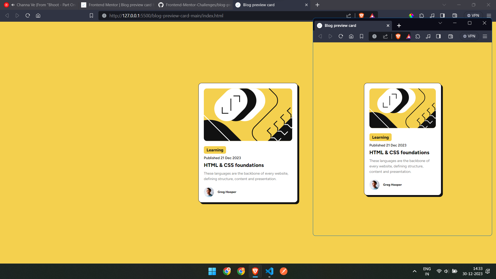

# Frontend Mentor - Blog preview card solution

This is a solution to the [Blog preview card challenge on Frontend Mentor](https://www.frontendmentor.io/challenges/blog-preview-card-ckPaj01IcS). 

## Table of contents

- [Overview](#overview)
  - [The challenge](#the-challenge)
  - [Screenshot](#screenshot)
  - [Links](#links)
- [My process](#my-process)
  - [Built with](#built-with)
  - [What I learned](#what-i-learned)
  - [Continued development](#continued-development)
  - [Useful resources](#useful-resources)
- [Author](#author)
- [Acknowledgments](#acknowledgments)

## Overview

### The challenge

Users should be able to:

- See hover and focus states for all interactive elements on the page

### Screenshot




### Links

- Live Site URL: [https://frontend-mentor-challenges-three-sandy.vercel.app/](https://frontend-mentor-challenges-three-sandy.vercel.app/)

## My process

### Built with

- Semantic HTML5 markup
- CSS custom properties
- Flexbox
- CSS Grid
- Mobile-first workflow ? maybe, i am not sure

### What I learned

* including tff files for font

```css
@font-face {
      font-family: Figtree;
      src: url(./assets/fonts/Figtree-VariableFont_wght.ttf);
    }
```

* for divs i can use:
```css
      align-self: center;
      width: fit-content;
```

* for the html, i only used divs. not sure if <p> or <span> or some other alternative would have reduced my code (by not requiring certain css)?

### Continued development

* there is huge doubt in my mind with the width and height?
* should it be fixed, in which case text should be cut off?
* but thats a desing problem so designer is needed i think.

### Useful resources

## Author
Maine hi likha hai 

## Acknowledgments
