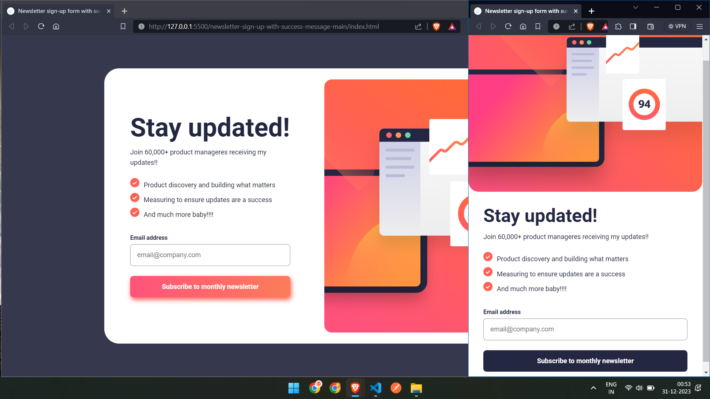

# Frontend Mentor - Newsletter sign-up form with success message solution

This is a solution to the [Newsletter sign-up form with success message challenge on Frontend Mentor](https://www.frontendmentor.io/challenges/newsletter-signup-form-with-success-message-3FC1AZbNrv).
## Table of contents

- [Overview](#overview)
  - [The challenge](#the-challenge)
  - [Screenshot](#screenshot)
  - [Links](#links)
- [My process](#my-process)
  - [Built with](#built-with)
  - [What I learned](#what-i-learned)
  - [Continued development](#continued-development)
  - [Useful resources](#useful-resources)
- [Author](#author)
- [Acknowledgments](#acknowledgments)

## Overview

### The challenge

Users should be able to:

- Add their email and submit the form
- See a success message with their email after successfully submitting the form
- See form validation messages if:
  - The field is left empty
  - The email address is not formatted correctly
- View the optimal layout for the interface depending on their device's screen size
- See hover and focus states for all interactive elements on the page

### Screenshot



### Links

find on github/vercel

## My process

### Built with

- Semantic HTML5 markup
- CSS custom properties
- Flexbox
- CSS Grid
- Mobile-first workflow
- JS (DOM)

### What I learned

 * script, if written within html, should be in body tag, below all html.

```css
::selection {
  background-color: var(--tomato-faded);
}
```

```css
ul {
  list-style-image: url(assets/images/icon-list.svg);
  list-style-type: hidden;
  list-style-position: inside;
}
```

```css
input[type="button"] {}
```

```css
background: linear-gradient(90deg, #ff537b, #fa9248 150%);
```


 * when i want css to take effect on an event and then go back, i can have primary css in css file and set attribute style onEvent, and then remove it; instead of modifying the style of the element
```js
document.getElementById('email').setAttribute('style','color:var(--tomato);background-color:var(--tomato-faded);border-color:var(--tomato)')
```
 * did this to update image
 ```js
 if (window.innerWidth<768){
  document.getElementsByClassName('image')[0].setAttribute('src', 'assets/images/illustration-sign-up-mobile.svg');
}
  ```

### Continued development

* should the success be a new html document? in that case do i use local storage to store the email address temporarily?
* this mobile first ? what is it? and how to decide what to do for intermediate screen sizes? I mean if the font size wasn't fixed i could do it relative to the screen size and get on with it for everything but for the task i am making it fixed.

### Useful resources

stackoverflow, w3s, mdn docs.

## Author
Mai hi hu.

## Acknowledgments

stackoverflow came to help again, this time for some JS how-to-dos.
